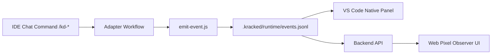

# Kracked_Skills Agent (KD)

<p align="center">
<strong>Structured Multi-Agent AI Execution System for Real Software Delivery</strong>
<br>


</p>

<p align="center">
Built by <a href="https://krackeddevs.com/">KRACKEDDEVS</a>
</p>

<p align="center">
<a href="#-quick-start">Quick Start</a> •
<a href="#-after-install-what-to-run">After Install</a> •
<a href="#-pixel-observer-native-panel-vs-code-family">Pixel Native Panel</a> •
<a href="#-commands">Commands</a> •
<a href="#-supported-tools--adapters">Supported Tools</a>
</p>

---

> **KD finishes what it starts.**

## Quick Start

### Install in Your Project

```bash
# npm (recommended)
npx kracked-skills-agent install

# or direct from this repo
npx github:MoonWIRaja/Kracked_Skills_Agent install
```

### Non-Interactive Install Example

```bash
npx github:MoonWIRaja/Kracked_Skills_Agent install --yes --language MS --tools antigravity,claude-code --agent Moon
```

### Install Questions You Will See
1. Language (EN / MS / custom)
2. IDE tools (codex, antigravity, cursor, opencode, kilocode, cline, claude-code)
3. Project name
4. Main Agent name

---

## After Install (What To Run)

### In IDE (Antigravity, Codex, Cursor, etc.)
Use KD commands directly in chat:

```text
/kd
/kd-help
/kd-analyze
```

If IDE does not auto-suggest slash commands, type manually.

### To See Pixel Observer UI (Web)

```bash
# terminal 1
cd backend
npm install
node server.js

# terminal 2
cd frontend
npm install
npm run dev
```

Open:
- `http://localhost:4892` (Pixel Observer UI)
- backend health: `http://localhost:4891/api/health`

---

## Pixel Observer Native Panel (VS Code Family)

Yes, native panel is available now for VS Code-compatible IDEs.

### Install Native Panel Extension

```bash
# from repo root
npm run panel:package

# then install generated .vsix
code --install-extension ide/vscode-kd-pixel-panel/kd-pixel-panel-0.1.0.vsix
```

Open panel from Command Palette:

```text
KD: Open Pixel Observer Panel
```

Works with event stream from your project:
- `.kracked/runtime/events.jsonl`

### Antigravity Compatibility

Antigravity uses the same bridge:

```bash
node .kracked/runtime/emit-event.js --source antigravity --agent-id main-agent --agent-name Moon --role "Master Agent" --action typing --task kd-prd --message "PRD ready"
```

So native panel can observe Antigravity sessions using this shared stream.

---

## Pixel Observer (How It Works)

1. KD adapters share one observer event stream:
2. Native panel and web UI both read the same stream.
3. `.kracked/runtime/events.jsonl`
4. Schema file:
5. `.kracked/runtime/SCHEMA.md`
6. Event emitter script:
7. `.kracked/runtime/emit-event.js`

Manual event example:

```bash
node .kracked/runtime/emit-event.js --source antigravity --agent-id main-agent --agent-name Moon --role "Master Agent" --action typing --task kd-prd --message "PRD ready"
```

Observer flow:



---

## Core Features

### Main Agent + Professional Agents
1. Main Agent name is configurable during install (`--agent`).
2. Professional agents are randomized automatically from name pool.
3. XP and Level are tied to Main Agent in `.kracked/security/xp.json`.

### Safe Reinstall in Same Project
Reinstall is supported and now preserves key work files:
1. `KD_output/status/status.md`
2. `.kracked/security/xp.json` (progress preserved, agent name updated if changed)
3. `.kracked/runtime/events.jsonl`
4. `.kracked/skills/memories/SKILL.md`

Use:

```bash
npx github:MoonWIRaja/Kracked_Skills_Agent install --yes --agent Qih --tools antigravity,claude-code
```

---

## Commands

| Category | Commands | Description |
|---|---|---|
| Core | `/kd`, `/kd-help`, `/kd-status` | Menu, guidance, state |
| Discovery | `/kd-analyze`, `/kd-brainstorm` | Discovery and solution shaping |
| Product | `/kd-prd`, `/kd-story` | Requirements and stories |
| Engineering | `/kd-dev-story`, `/kd-refactor` | Build and refactor |
| Quality | `/kd-code-review`, `/kd-test`, `/kd-security-audit` | QA and security |
| Delivery | `/kd-deploy`, `/kd-release` | Deploy and release |

---

## Supported Tools & Adapters

| Tool | Adapter Output | Auto Setup |
|---|---|---|
| Codex | `.codex/INSTRUCTIONS.md` + `.codex/commands/` | Yes |
| Antigravity | `.agent/workflows/` + `.agents/skills/` | Yes |
| Cursor | `.cursor/commands/` | Yes |
| OpenCode | `.opencode/agents/` | Yes |
| Kilo Code | `.kilocode/workflows/` + `.kilocodemodes` | Yes |
| Cline | `.clinerules/workflows/` | Yes |
| Claude Code | `CLAUDE.md` + `.claude/commands/` | Yes |

---

## Project Structure

```text
.kracked/
├── agents/                    # role definitions
├── prompts/                   # system and role prompts
├── workflows/                 # KD command workflows
├── skills/                    # modular skills
├── runtime/
│   ├── SCHEMA.md              # observer event schema
│   ├── events.jsonl           # shared event stream
│   └── emit-event.js          # event appender
├── security/
│   └── xp.json                # main-agent XP tracking
└── config/
    ├── settings.json
    ├── main-agent.json
    └── agents.json

KD_output/
└── status/status.md
```

---

## Maintenance

```bash
npx kracked-skills-agent update
npx kracked-skills-agent uninstall
npx kracked-skills-agent help
```

---

## License

MIT License - see [LICENSE](LICENSE).

---

<p align="center">
<strong>KD finishes what it starts.</strong><br>
<em>by KRACKEDDEVS</em>
</p>
