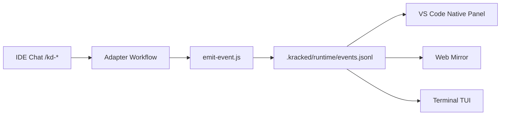

# Kracked_Skills Agent (KD)

<p align="center">
<strong>Structured Multi-Agent AI Execution System for Real Software Delivery</strong>
<br>


</p>

<p align="center">
Built by <a href="https://krackeddevs.com/">KRACKEDDEVS</a>
</p>

<p align="center">
<a href="#quick-start">Quick Start</a> |
<a href="#what-install-sets-up">What Install Sets Up</a> |
<a href="#pixel-observer-modes">Pixel Observer Modes</a> |
<a href="#commands">Commands</a> |
<a href="#supported-tools-and-adapters">Supported Tools</a>
</p>

---

> **KD finishes what it starts.**

## Quick Start

### Install (Interactive)

```bash
npx github:MoonWIRaja/Kracked_Skills_Agent install
```

### Install (Non-Interactive)

```bash
npx github:MoonWIRaja/Kracked_Skills_Agent install --yes --language MS --tools antigravity,claude-code --agent Moon --panel
```

### Questions During Interactive Install

1. Language (EN / MS / custom)
2. IDE tools (codex, antigravity, cursor, opencode, kilocode, cline, claude-code)
3. Project name
4. Main Agent name
5. Install native Pixel panel now? (yes/no)

Installer now uses a cyberpunk black-green CLI style.

## What Install Sets Up

Yes, **install biasa** sekarang setup semua keperluan utama KD.

Auto-created in your project:

1. `.kracked/` system files (agents, workflows, prompts, skills, config)
2. `KD_output/` output folders
3. Runtime observer files:
   - `.kracked/runtime/events.jsonl`
   - `.kracked/runtime/SCHEMA.md`
   - `.kracked/runtime/emit-event.js`
   - `.kracked/runtime/pixel-tui.js`
   - `.kracked/runtime/pixel-web.js`
4. Helper scripts at project root:
   - `kd-panel-install.bat` / `kd-panel-install.ps1`
   - `kd-panel-tui.bat` / `kd-panel-tui.ps1`
   - `kd-panel-web.bat` / `kd-panel-web.ps1`
5. IDE adapter files based on selected tools

## After Install

In your AI IDE chat:

```text
/kd
/kd-help
/kd-analyze
```

If slash command suggestions do not appear, type manually.

## Pixel Observer Modes

KD supports 3 observer modes.

### 1. Native Panel (VS Code Family)

For VS Code / Cursor / Windsurf.

Install extension from project root:

```bash
kd-panel-install.bat
# or
powershell -ExecutionPolicy Bypass -File .\kd-panel-install.ps1
```

After install + IDE reload, open from bottom panel area:

```text
KD Pixel -> Pixel Observer
```

Command palette fallback:

```text
KD Pixel: Show Panel
```

### 2. Web Mirror (Recommended for Antigravity)

Visual browser panel that reads the same KD events stream.

```bash
kd-panel-web.bat
# or
powershell -ExecutionPolicy Bypass -File .\kd-panel-web.ps1
```

Custom port:

```bash
kd-panel-web.bat 4900
# or
npx kracked-skills-agent observe-web --port 4900
```

### 3. Terminal TUI

```bash
kd-panel-tui.bat
# or
powershell -ExecutionPolicy Bypass -File .\kd-panel-tui.ps1
```

Or via CLI:

```bash
npx kracked-skills-agent observe --interval 800 --max-events 15
```

Press `q` to quit TUI.

## Antigravity Note

- Antigravity can fully use KD workflows and event stream.
- Native `.vsix` panel cannot be embedded inside Antigravity app host.
- Use `kd-panel-web.*` (recommended visual) or `kd-panel-tui.*`.

## Observer Flow



Manual event sample:

```bash
node .kracked/runtime/emit-event.js --source antigravity --agent-id main-agent --agent-name Moon --role "Master Agent" --action typing --task kd-prd --message "PRD ready"
```

## Core System Behavior

### Main Agent and Professional Agents

1. Main Agent name is configurable (`--agent`)
2. Professional agent names are randomized from configured name pool
3. XP and level are tied to Main Agent in `.kracked/security/xp.json`

### Safe Reinstall (Same Project)

Reinstall is supported and preserves key user progress files:

1. `KD_output/status/status.md`
2. `.kracked/security/xp.json`
3. `.kracked/runtime/events.jsonl`
4. `.kracked/skills/memories/SKILL.md`

Example reinstall:

```bash
npx github:MoonWIRaja/Kracked_Skills_Agent install --yes --agent Qih --tools antigravity,claude-code
```

## Commands

### IDE Workflow Commands

- `/kd`, `/kd-help`, `/kd-status`
- `/kd-analyze`, `/kd-brainstorm`
- `/kd-prd`, `/kd-story`
- `/kd-dev-story`, `/kd-refactor`
- `/kd-code-review`, `/kd-test`, `/kd-security-audit`
- `/kd-deploy`, `/kd-release`

### CLI Utility Commands

```bash
npx kracked-skills-agent help
npx kracked-skills-agent stats
npx kracked-skills-agent observe
npx kracked-skills-agent observe-web --port 4892
npx kracked-skills-agent update
npx kracked-skills-agent uninstall
```

## Supported Tools and Adapters

| Tool | Adapter Output | Auto Setup |
|---|---|---|
| Codex | `.codex/INSTRUCTIONS.md` + `.codex/commands/` | Yes |
| Antigravity | `.agent/workflows/` + `.agents/skills/` | Yes |
| Cursor | `.cursor/commands/` | Yes |
| OpenCode | `.opencode/agents/` | Yes |
| Kilo Code | `.kilocode/workflows/` + `.kilocodemodes` | Yes |
| Cline | `.clinerules/workflows/` | Yes |
| Claude Code | `CLAUDE.md` + `.claude/commands/` | Yes |

## Project Structure

```text
.kracked/
|-- agents/
|-- prompts/
|-- workflows/
|-- skills/
|-- runtime/
|   |-- SCHEMA.md
|   |-- events.jsonl
|   |-- emit-event.js
|   |-- pixel-tui.js
|   `-- pixel-web.js
|-- security/
|   `-- xp.json
`-- config/
    |-- settings.json
    |-- main-agent.json
    `-- agents.json

KD_output/
`-- status/status.md
```

## Troubleshooting

### `npm run panel:package` missing in target project

Use project helper script instead:

```bash
kd-panel-install.bat
```

### VSIX install fails

Check:

1. VS Code CLI `code` is available in PATH
2. You are running from project root
3. `.kracked/tools/vscode-kd-pixel-panel` exists

### Antigravity but panel tidak muncul

Use:

```bash
kd-panel-web.bat
```

## License

MIT License - see [LICENSE](LICENSE).

## About

KRACKEDDEVS builds AI-powered developer tools.

- Website: [krackeddevs.com](https://krackeddevs.com/)
- GitHub: [MoonWIRaja/Kracked_Skills_Agent](https://github.com/MoonWIRaja/Kracked_Skills_Agent)

<p align="center">
<strong>KD finishes what it starts.</strong>
</p>
