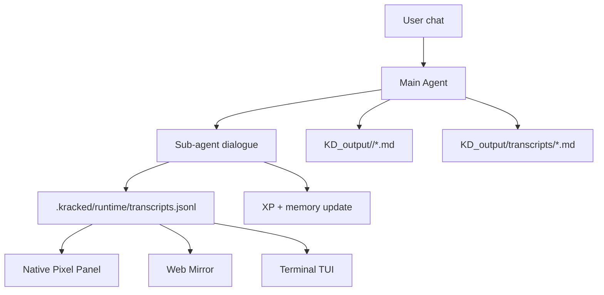

# Kracked_Skills Agent (KD)

<p align="center">
<strong>Structured multi-agent AI workflow system for real software delivery</strong>
<br>


</p>

<p align="center">
Built by <a href="https://krackeddevs.com/">KRACKEDDEVS</a>
</p>

<p align="center">
<a href="#quick-start">Quick Start</a> |
<a href="#installer-menu">Installer Menu</a> |
<a href="#how-kd-works">How KD Works</a> |
<a href="#commands">Commands</a> |
<a href="#observer-modes">Observer Modes</a>
</p>

---

> **KD finishes what it starts.**

## Quick Start

### Interactive install

```bash
npx github:MoonWIRaja/Kracked_Skills_Agent install
```

### Non-interactive install

```bash
npx github:MoonWIRaja/Kracked_Skills_Agent install --yes --language MS --tools codex,cursor --agent Moon --panel
```

Rules:
- `main agent` name is required
- sub-agent names are randomized from the name pool
- reinstall preserves roster, XP, runtime history, and memory
- install language controls chat, planning, explanations, transcripts, and document prose
- code and code comments stay in English unless the user explicitly requests another language

## Installer Menu

Running:

```bash
npx github:MoonWIRaja/Kracked_Skills_Agent install
```

opens this main menu:

```text
MAIN MENU:

1. Install
2. Reinstall / Update
3. Uninstall
4. Info
0. Exit
```

If you choose `Install`, KD opens the package menu:

```text
INSTALL PACKAGE:

1. Kracked Skills
2. Pixel Panel
3. Both
0. Back
```

Package behavior:
- `Kracked Skills` installs the KD workflow system without auto-installing the native panel
- `Pixel Panel` installs the panel only if KD already exists, or falls back to full setup if it does not
- `Both` installs KD and auto-installs the native panel

If you choose `Info`, KD shows:
- usage
- CLI commands
- installer options
- examples
- supported IDE tools

## What Install Sets Up

KD installs these core pieces into the target project:

1. `.kracked/`
2. `KD_output/`
3. root helper scripts for Pixel observer and panel install
4. IDE adapter files for the selected tools

Important generated files:

```text
.kracked/
|-- agents/
|-- prompts/
|-- workflows/
|-- skills/
|-- runtime/
|   |-- SCHEMA.md
|   |-- events.jsonl
|   |-- transcripts.jsonl
|   |-- emit-event.js
|   |-- emit-transcript.js
|   |-- pixel-tui.js
|   `-- pixel-web.js
|-- security/
|   `-- xp.json
`-- config/
    |-- settings.json
    |-- main-agent.json
    `-- agents.json

KD_output/
|-- status/
|-- discovery/
|-- brainstorm/
|-- PRD/
|-- architecture/
|-- epics-and-stories/
|-- deployment/
|-- release/
|-- code-review/
`-- transcripts/
```

## How KD Works

### Agent model

Each project gets:
- `1 main agent`
- `11 sub-agent roles`

Sub-agent roles:
1. `analyst`
2. `pm`
3. `architect`
4. `tech-lead`
5. `engineer`
6. `qa`
7. `security`
8. `devops`
9. `release-manager`
10. `ui-ux-frontend`
11. `backend-api`

Rules:
- the user must provide the `main agent` name during install
- sub-agent names are randomized and then persisted per project
- one role uses one name only
- user can chat directly with any sub-agent through `@Name`
- if the mention is invalid, KD routes the user to `/kd-roster`

### Language enforcement

KD reads the project language from `.kracked/config/settings.json`.

Enforced behavior:
- planning, chat, explanation, transcripts, summaries, and document prose use the selected project language
- code, code comments, identifiers, API field names, and tests stay in English unless the user explicitly asks otherwise

### Output contract

Every `/kd-*` command is expected to produce:
1. scene header
2. agent transcript
3. decision summary
4. detailed artifacts
5. project state update
6. next action footer

Footer format:

```text
Next command: /kd-...
XP updated: +N
Learning bonus: +M / none
Memory updated: yes/no
Artifacts written: [list]
Agents consulted: [list]
```

## Default Workflow

The official flow is:

```text
/kd
/kd-roster
/kd-analyze
/kd-brainstorm
/kd-prd
/kd-arch
/kd-story
/kd-sprint-planning
/kd-dev-story
/kd-test
/kd-code-review
/kd-validate
/kd-deploy
/kd-release
/kd-sprint-review
/kd-retrospective
```

Important behavior:
- `/kd-analyze` is the official entry command
- `/kd-new` is now a compatibility alias to `/kd-analyze`
- `/kd-role-analyst` is now a compatibility shim that points users to `@<analyst-name>` or `/kd-roster`

## Commands

### Core chat commands

- `/kd`
- `/kd-help`
- `/kd-status`
- `/kd-roster`
- `/kd-kickoff`

### Main workflow commands

- `/kd-analyze`
- `/kd-brainstorm`
- `/kd-prd`
- `/kd-arch`
- `/kd-story`
- `/kd-sprint-planning`
- `/kd-dev-story`
- `/kd-test`
- `/kd-refactor`
- `/kd-code-review`
- `/kd-validate`
- `/kd-deploy`
- `/kd-release`
- `/kd-sprint-review`
- `/kd-retrospective`

### Specialist commands

- `/kd-api-design`
- `/kd-db-schema`
- `/kd-security-audit`

### Compatibility commands

- `/kd-new`
- `/kd-role-analyst`

Detailed command reference is available in [command.md](./command.md).

## CLI Commands

Terminal commands:

```bash
npx kracked-skills-agent install
npx kracked-skills-agent update
npx kracked-skills-agent uninstall
npx kracked-skills-agent stats
npx kracked-skills-agent observe
npx kracked-skills-agent observe-web --port 4892
npx kracked-skills-agent help
npx kracked-skills-agent version
```

You can also run the installer directly from GitHub:

```bash
npx github:MoonWIRaja/Kracked_Skills_Agent install
```

## Observer Modes

KD supports three observer modes that all read the same runtime data.

### 1. Native Pixel Panel

Best for VS Code family tools.

Install from the project root:

```bash
kd-panel-install.bat
# or
powershell -ExecutionPolicy Bypass -File .\kd-panel-install.ps1
```

### 2. Web Mirror

Useful for Antigravity and browser-based viewing.

```bash
kd-panel-web.bat
# or
powershell -ExecutionPolicy Bypass -File .\kd-panel-web.ps1
```

Custom port:

```bash
npx kracked-skills-agent observe-web --port 4900
```

### 3. Terminal TUI

```bash
kd-panel-tui.bat
# or
powershell -ExecutionPolicy Bypass -File .\kd-panel-tui.ps1
```

Or via CLI:

```bash
npx kracked-skills-agent observe --interval 800 --max-events 15
```

## Observer Data Flow


```mermaid
flowchart TD
    A["User chat"] --> B["Main Agent"]
    B --> C["Sub-agent dialogue"]
    C --> D[".kracked/runtime/transcripts.jsonl"]
    B --> E["KD_output/<stage>/*.md"]
    B --> F["KD_output/transcripts/*.md"]
    C --> G["XP + memory update"]
    D --> H["Native Pixel Panel"]
    D --> I["Web Mirror"]
    D --> J["Terminal TUI"]
```

## Supported Tools and Adapters

| Tool | Adapter Output |
|---|---|
| Codex | `.codex/INSTRUCTIONS.md` + `.codex/commands/` |
| Antigravity | `.agent/workflows/` + `.agents/skills/` |
| Cursor | `.cursor/commands/` |
| OpenCode | `.opencode/agents/` |
| Kilo Code | `.kilocode/workflows/` + `.kilocodemodes` |
| Cline | `.clinerules/workflows/` |
| Claude Code | `CLAUDE.md` + `.claude/commands/` |

## Safe Reinstall

Reinstall keeps important project state where possible, including:
- `KD_output/status/status.md`
- `.kracked/security/xp.json`
- `.kracked/runtime/events.jsonl`
- `.kracked/runtime/transcripts.jsonl`
- `.kracked/skills/memories/SKILL.md`
- `.kracked/config/agents.json`

## Troubleshooting

### Slash commands do not auto-suggest

Type the command manually first:

```text
/kd
/kd-help
/kd-analyze
```

### Native panel is not installed yet

Use the helper script from the target project:

```bash
kd-panel-install.bat
```

### Antigravity cannot host the VSIX panel

Use:
- `kd-panel-web.*`
- or `kd-panel-tui.*`

### Need the full command flow

Open [command.md](./command.md).
