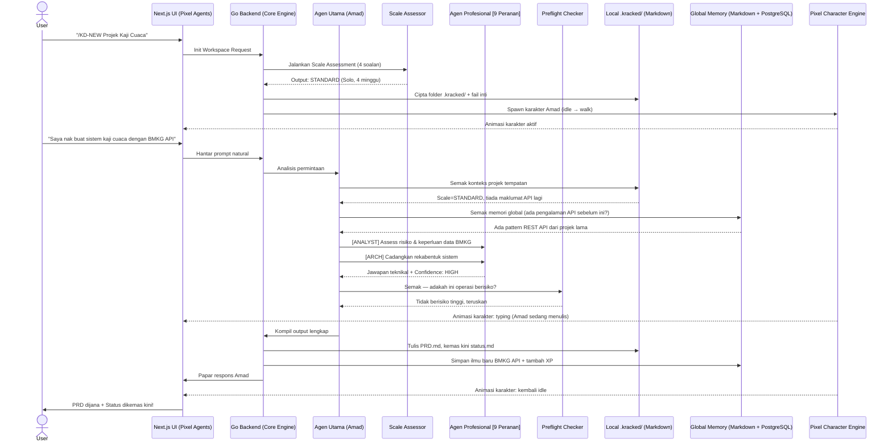
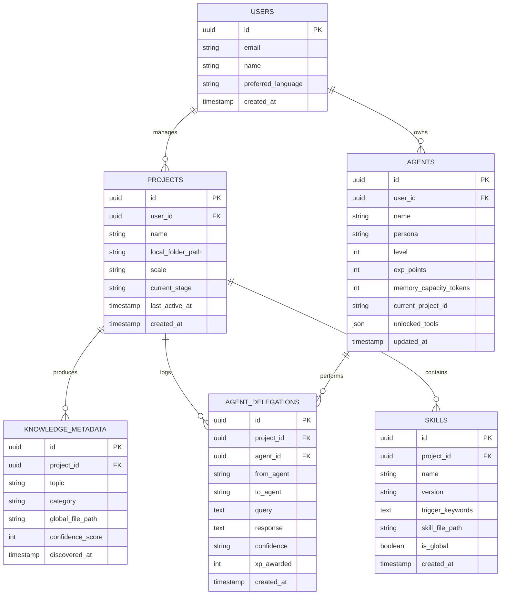

# PRD — Kracked_Skills Agent (KD)
### Product Requirements Document v2.0
*Gabungan BMAD-METHOD + pixel-agents + opencode-skills + Kracked_Skills*

---

## Jadual Kandungan

1. [Overview & Visi](#1-overview--visi)
2. [Masalah yang Diselesaikan](#2-masalah-yang-diselesaikan)
3. [Prinsip Reka Bentuk](#3-prinsip-reka-bentuk)
4. [Seni Bina Sistem](#4-seni-bina-sistem)
5. [Struktur Skill & Agent](#5-struktur-skill--agent)
6. [9 Peranan Agen Profesional](#6-9-peranan-agen-profesional)
7. [8 Peringkat Pelaksanaan](#7-8-peringkat-pelaksanaan)
8. [Sistem Arahan (Commands)](#8-sistem-arahan-commands)
9. [Sistem Memori & Pengetahuan](#9-sistem-memori--pengetahuan)
10. [Sistem Level & XP](#10-sistem-level--xp)
11. [Scale Assessment](#11-scale-assessment)
12. [Protokol Multi-Agent](#12-protokol-multi-agent)
13. [Aliran Pengguna (User Flow)](#13-aliran-pengguna-user-flow)
14. [Skema Pangkalan Data](#14-skema-pangkalan-data)
15. [Struktur Fail Sistem](#15-struktur-fail-sistem)
16. [Tech Stack](#16-tech-stack)
17. [Adapter System](#17-adapter-system)
18. [Antarmuka Visual (Pixel UI)](#18-antarmuka-visual-pixel-ui)
19. [Piawaian Output Artefak](#19-piawaian-output-artefak)
20. [Roadmap Pembangunan](#20-roadmap-pembangunan)

---

## 1. Overview & Visi

**Kracked_Skills Agent (KD)** adalah sistem AI multi-agen yang bertindak sebagai rakan kongsi pembangunan perisian yang padu — bukan sekadar pembantu. Sistem ini menggabungkan kekuatan empat pendekatan terbaik yang sedia ada:

- **Daripada BMAD-METHOD**: Metodologi agile berstruktur, stage gates, 21+ agen khusus, dan scale-adaptive intelligence.
- **Daripada pixel-agents**: Visualisasi agen sebagai karakter pixel art yang animasinya mencerminkan aktiviti sebenar (menulis kod, membaca fail, menunggu input).
- **Daripada opencode-skills**: Sistem SKILL.md modular, XP leveling yang konkrit, session memory yang berstruktur, dan preflight checklist untuk operasi berisiko.
- **Daripada Kracked_Skills**: 9 peranan terstruktur, 8 peringkat berurutan, 80+ arahan, sokongan Bahasa Melayu, dan output yang teratur dalam folder `.kracked/`.

**Misi utama**: AI yang tidak pernah lupa, tidak pernah andaikan, dan semakin bijak dengan setiap projek yang diselesaikan.

**Slogan**: *KD finishes what it starts.*

---

## 2. Masalah yang Diselesaikan

| Masalah | Penyebab | Penyelesaian KD |
|---|---|---|
| AI lupa konteks pertengahan projek | Tiada persistent state | Status Tracker + Local/Global Memory |
| AI hasilkan output generik | Tiada peranan khusus | 9 Specialized Agent Roles |
| Pengguna tidak tahu apa perlu dibuat seterusnya | Tiada workflow guide | `/KD-help` + Stage Gates |
| AI terus buat kerja berisiko tanpa konfirmasi | Tiada preflight check | Preflight Safety Protocol |
| Kemajuan AI tidak dapat diukur | Tiada sistem metrik | XP Leveling System |
| Output AI berselerak tiada struktur | Tiada output standard | Organized `.kracked/KD_output/` |
| AI tidak adapt mengikut saiz projek | Satu pendekatan untuk semua | Scale Assessment (SMALL/STANDARD/DEEP) |
| Konflik cadangan antara agen | Tiada resolusi protokol | Confidence Scoring + Conflict Resolution |

---

## 3. Prinsip Reka Bentuk

**1. Lokal dahulu, Global kemudian** — AI sentiasa semak fail projek tempatan (`/local/.kracked/`) sebelum rujuk memori global. Ini memastikan AI faham konteks projek semasa.

**2. Jangan andaikan, tanya dengan struktur** — AI tidak buat keputusan besar tanpa validation block yang menunjukkan impak, keyakinan, dan risiko.

**3. Setiap tindakan ada rekod** — Setiap respons AI menulis kemas kini ke `status.md` supaya konteks tidak pernah hilang walaupun sesi ditutup.

**4. Modular dan boleh dipasang** — Skills adalah fail Markdown bebas yang boleh ditambah, dikeluarkan, atau dikongsi merentas projek.

**5. Bahasa natural, bukan arahan rigid** — Pengguna boleh bercakap dalam bahasa biasa. KD memahami niat dan boleh operasi tanpa sintaks khusus kecuali untuk tindakan eksplisit.

**6. Boleh digunakan di mana-mana AI tool** — KD bukan terikat kepada satu platform. Ia berfungsi dalam Claude Code, Cursor, OpenCode, atau mana-mana IDE melalui adapter.

---

## 4. Seni Bina Sistem



---

## 5. Struktur Skill & Agent

### 5.1 Format Standard SKILL.md

Setiap fail skill mesti menggunakan frontmatter YAML berikut:

```yaml
---
skill: nama-skill
version: 1.0.0
language: [EN, MS]
triggers:
  - kata-kunci-1
  - kata-kunci-2
agents:
  - backend
  - security
confidence_default: HIGH
xp_reward: 30
preflight_required: false
---

# [Nama Skill]

## Objektif
[Huraian ringkas apa yang skill ini lakukan]

## Arahan
[Arahan lengkap untuk agen]

## Corak yang Digunakan
[Pattern & best practices]

## Anti-Corak (Elak Ini)
[Common mistakes to avoid]

## Contoh
[Contoh penggunaan]
```

### 5.2 Hierarki Fail Skill

```
.kracked/
├── agents/                     # Definisi 9 agen profesional
│   ├── analyst.md
│   ├── pm.md
│   ├── architect.md
│   ├── tech-lead.md
│   ├── engineer.md
│   ├── qa.md
│   ├── security.md
│   ├── devops.md
│   └── release-manager.md
├── skills/                     # Skill modular
│   ├── commit/SKILL.md         # Konvensyen commit message
│   ├── memories/SKILL.md       # Session memory (auto-dikemas kini)
│   ├── webapp/SKILL.md         # Corak React, Vue, Angular
│   ├── mobile/SKILL.md         # React Native, Flutter, Swift
│   ├── security/SKILL.md       # Security patterns & anti-patterns
│   ├── api-design/SKILL.md     # REST/GraphQL API patterns
│   ├── database/SKILL.md       # SQL/NoSQL patterns
│   ├── testing/SKILL.md        # TDD & test patterns
│   └── devops/SKILL.md         # CI/CD & deployment patterns
├── prompts/
│   ├── system-prompt.md        # System prompt teras
│   ├── roles/                  # Prompt untuk 9 peranan
│   ├── stages/                 # Prompt untuk 8 peringkat
│   └── multi-agent/            # Protokol multi-agent
├── templates/                  # 9 template dokumen
├── checklists/                 # 6 senarai semak kualiti
├── workflows/                  # 4 definisi workflow
├── config/
│   ├── settings.json           # Konfigurasi projek
│   ├── scale.json              # Hasil scale assessment
│   └── language/               # String EN + MS
└── security/
    ├── xp.json                 # Penjejak XP (auto-dikemas kini)
    └── knowledge.md            # Penemuan terkumpul (auto-dikemas kini)
```

### 5.3 Sistem Routing Pengetahuan

```
Pengguna bertanya
       ↓
[1] Semak Local .kracked/ skills/ → Ada? → Guna maklumat tempatan
       ↓ Tidak ada
[2] Semak Global Memory Markdown → Ada pattern lepas? → Guna
       ↓ Tidak ada
[3] Web Research (jika level ≥ 3) → Cari maklumat semasa
       ↓ Tidak ada
[4] Delegate ke Expert Agent yang berkaitan
       ↓
[5] Compile semua jawapan → Validation Block → Balas pengguna
       ↓
[6] Simpan ilmu baru ke Global + kemas kini status.md
```

---

## 6. 9 Peranan Agen Profesional

Amad (Agen Utama) menguruskan pasukan agen dalaman. Setiap agen mempunyai nama, fokus, dan gaya unik.

| Peranan | Awalan | Nama Contoh | Fokus Utama |
|---|---|---|---|
| Analyst | `[ANALYST]` | Ara | Discovery, risiko, penilaian skala, keperluan |
| Product Manager | `[PM]` | Paan | Product brief, PRD, keperluan pengguna |
| Architect | `[ARCH]` | Adi | Rekabentuk sistem, tech stack, keputusan |
| Tech Lead | `[TL]` | Teja | Epik, cerita, perancangan teknikal |
| Engineer | `[ENG]` | Ezra | Implementasi kod, TDD, testing |
| QA | `[QA]` | Qila | Code review, liputan ujian, kualiti |
| Security | `[SEC]` | Sari | Audit keselamatan, kelemahan, compliance |
| DevOps | `[DEVOPS]` | Dian | Deployment, CI/CD, monitoring |
| Release Manager | `[RM]` | Rina | Nota keluaran, versioning, changelog |

### 6.1 Personality Setiap Agen

```markdown
# analyst.md

**Nama**: Ara
**Peranan**: Analyst
**Personaliti**: Teliti, berhati-hati, suka bertanya "kenapa" sebelum "bagaimana"
**Gaya Komunikasi**: Berstruktur, menggunakan bullet points dan risk matrix
**Kepakaran**: Requirements elicitation, risk assessment, feasibility study
**Confidence Threshold**: Hanya beri HIGH jika 80%+ yakin

**Prompt Teras**:
Kamu adalah Ara, pakar analisis sistem. Apabila menerima permintaan,
kamu mesti: (1) Kenal pasti keperluan sebenar vs keperluan yang dinyatakan,
(2) Kenalpasti risiko dalam masa 30 saat pertama membaca,
(3) Berikan skala keyakinan pada setiap cadangan kamu.
```

### 6.2 Cara Amad Memilih Agen

```
Permintaan masuk
       ↓
Amad analisis keyword:
  "reka bentuk sistem" → Panggil [ARCH] Adi
  "tulis kod" → Panggil [ENG] Ezra
  "semak keselamatan" → Panggil [SEC] Sari
  "hantar ke production" → Panggil [DEVOPS] Dian
  "keperluan pengguna" → Panggil [PM] Paan + [ANALYST] Ara
  Tidak pasti → Panggil [ANALYST] Ara dahulu
       ↓
Kumpul jawapan semua agen yang dipanggil
       ↓
Conflict Resolution jika ada percanggahan
       ↓
Compile jawapan final dengan confidence scoring
```

---

## 7. 8 Peringkat Pelaksanaan

KD mengikuti aliran kerja berstruktur 8 peringkat dengan entry/exit criteria jelas.

```
Discovery → Brainstorm → Requirements → Architecture → Implementation → Quality → Deployment → Release
```

### 7.1 Huraian Setiap Peringkat

---

**Peringkat 1: Discovery** `[ANALYST]`

*Tujuan*: Faham masalah sebenar sebelum menulis satu baris pun.

Entry Criteria: Pengguna ada idea/masalah yang ingin diselesaikan.

Aktiviti:
- Scale Assessment (4 soalan wajib)
- Stakeholder & pengguna sasaran
- Penilaian risiko awal
- Kajian pasaran & pesaing (jika Level ≥ 3, gunakan web research)
- Tentukan "Definition of Done"

Exit Criteria: `discovery.md` dijana dan diluluskan pengguna.

Output Artefak: `.kracked/KD_output/discovery/discovery.md`

---

**Peringkat 2: Brainstorm** `[ANALYST] + [PM]`

*Tujuan*: Explore semua kemungkinan penyelesaian sebelum commit.

Entry Criteria: `discovery.md` selesai dan diluluskan.

Aktiviti:
- Hasilkan 3–5 pendekatan berbeza
- Scoring setiap pendekatan (nilai, usaha, risiko)
- Party Mode: Spawn 2-4 agen dengan perspektif berbeza
- Pilih pendekatan terbaik secara konsensus

Exit Criteria: `brainstorm.md` dengan cadangan yang dipilih.

Output Artefak: `.kracked/KD_output/brainstorm/brainstorm.md`

---

**Peringkat 3: Requirements** `[PM]`

*Tujuan*: Tukar idea kepada keperluan yang boleh dibina.

Entry Criteria: `brainstorm.md` dengan pendekatan yang dipilih.

Aktiviti:
- Product Brief (masalah, pengguna, MVP scope)
- PRD penuh (persona, metrik, risiko)
- User stories peringkat tinggi
- Kriteria penerimaan untuk setiap feature

Exit Criteria: `prd.md` diluluskan pengguna.

Output Artefak: `.kracked/KD_output/PRD/prd.md`

---

**Peringkat 4: Architecture** `[ARCH] + [SEC]`

*Tujuan*: Buat keputusan teknikal yang akan bentuk keseluruhan sistem.

Entry Criteria: `prd.md` selesai.

Aktiviti:
- Pilih tech stack (dengan justifikasi)
- Reka diagram sistem (sequence, ER, komponen)
- API design (endpoint, schema, authentication)
- Security architecture review
- Decision log (rekod setiap keputusan besar)

Exit Criteria: `architecture.md` dengan semua ADR (Architecture Decision Records).

Output Artefak: `.kracked/KD_output/architecture/architecture.md`

---

**Peringkat 5: Implementation** `[TL] + [ENG]`

*Tujuan*: Tukar rancangan kepada kod berfungsi, satu cerita pada satu masa.

Entry Criteria: `architecture.md` selesai.

Aktiviti:
- Pecah kepada Epik dan Cerita
- Sprint planning
- TDD: Tulis ujian dahulu, kemudian implementasi
- Update `status.md` selepas setiap cerita selesai

Exit Criteria: Semua cerita dalam sprint selesai dan ujian pass.

Output Artefak: `.kracked/KD_output/epics-and-stories/`

---

**Peringkat 6: Quality** `[QA] + [SEC]`

*Tujuan*: Pastikan kod berfungsi, selamat, dan boleh diselenggara.

Entry Criteria: Feature selesai diimplementasi.

Aktiviti:
- Code review sistematik
- Security audit (semak OWASP Top 10)
- Liputan ujian (sasaran ≥ 80%)
- Performance testing jika relevan
- Dokumentasi kod

Exit Criteria: Zero high/critical issues, liputan ujian mencapai sasaran.

Output Artefak: `.kracked/KD_output/code-review/code-review.md`

---

**Peringkat 7: Deployment** `[DEVOPS]`

*Tujuan*: Hantar kod ke persekitaran pengeluaran dengan selamat.

Entry Criteria: QA selesai, semua ujian pass.

Aktiviti:
- Pelan deployment (termasuk rollback plan)
- Setup CI/CD pipeline
- Environment variable & secrets management
- Health checks & monitoring
- Preflight check wajib sebelum sebarang deployment

Exit Criteria: Aplikasi berjalan di production, monitoring aktif.

Output Artefak: `.kracked/KD_output/deployment/deployment-plan.md`

---

**Peringkat 8: Release** `[RM]`

*Tujuan*: Dokumen dan komunikasi perubahan kepada semua pihak.

Entry Criteria: Deployment berjaya.

Aktiviti:
- Tulis release notes
- Kemas kini changelog (format Semantic Versioning)
- Post-mortem jika ada insiden
- Retrospective untuk pelajari pengajaran
- Sinkron ilmu baru ke Global Memory + tambah XP

Exit Criteria: `release-notes.md` selesai, XP dikreditkan.

Output Artefak: `.kracked/KD_output/release/release-notes.md`

---

## 8. Sistem Arahan (Commands)

### 8.1 Arahan Setup & Navigasi

| Arahan | Huraian |
|---|---|
| `/KD` | Tunjukkan menu interaktif semua arahan |
| `/KD-NEW [nama projek]` | Inisialisasi workspace projek baru |
| `/KD-kickoff` | Muat konteks projek sedia ada + orientasi semula |
| `/KD-help [soalan pilihan]` | Panduan pintar — beritahu apa perlu dibuat seterusnya |
| `/KD-status` | Papar status projek semasa dari `status.md` |
| `/KD-lang [EN/MS]` | Tukar bahasa antarmuka |

### 8.2 Arahan Aliran Teras

| Arahan | Agen | Huraian |
|---|---|---|
| `/KD-analyze` | `[ANALYST]` | Mulakan Discovery & Scale Assessment |
| `/KD-brainstorm` | `[ANALYST]+[PM]` | Sesi brainstorming penyelesaian |
| `/KD-prd` | `[PM]` | Jana PRD penuh |
| `/KD-arch` | `[ARCH]+[SEC]` | Reka bentuk architecture |
| `/KD-story [epic-id]` | `[TL]` | Pecah epic kepada cerita |
| `/KD-dev-story [story-id]` | `[ENG]` | Implementasi satu cerita (TDD) |
| `/KD-code-review` | `[QA]+[SEC]` | Jalankan code review |
| `/KD-deploy` | `[DEVOPS]` | Jana pelan deployment |
| `/KD-release` | `[RM]` | Cipta release notes |

### 8.3 Arahan Agile & Eksekusi

| Arahan | Huraian |
|---|---|
| `/KD-sprint-planning` | Inisialisasi sprint tracking |
| `/KD-sprint-review` | Semak sprint semasa |
| `/KD-retrospective` | Jalankan retrospective |
| `/KD-refactor [fail]` | Refactor kod dengan panduan TL + ENG |
| `/KD-fix-course` | Kesan dan betul penyelewengan dari rancangan |
| `/KD-validate` | Sahkan bahawa output memenuhi keperluan |

### 8.4 Arahan Peranan Khusus

| Arahan | Huraian |
|---|---|
| `/KD-role-analyst` | Aktifkan mod Analyst penuh |
| `/KD-role-pm` | Aktifkan mod Product Manager |
| `/KD-role-architect` | Aktifkan mod Architect |
| `/KD-role-dev` | Aktifkan mod Engineer |
| `/KD-role-security` | Aktifkan mod Security Expert |
| `/KD-role-devops` | Aktifkan mod DevOps |

### 8.5 Arahan API & Backend

| Arahan | Huraian |
|---|---|
| `/KD-api-design` | Reka bentuk REST/GraphQL endpoint yang teguh dan selamat |
| `/KD-db-schema` | Jana dan optimumkan skema database |
| `/KD-auth-design` | Reka bentuk sistem authentication & authorization |

### 8.6 Arahan Testing

| Arahan | Huraian |
|---|---|
| `/KD-test` | Jana test suite untuk kod semasa |
| `/KD-test-arch` | Reka strategi testing enterprise-grade |
| `/KD-test-automate` | Automasikan test coverage |
| `/KD-security-audit` | Jalankan security audit penuh (dengan XP reward) |

### 8.7 Arahan Inovasi & Kreativiti

| Arahan | Huraian |
|---|---|
| `/KD-idea-design-thinking` | Sesi design thinking untuk masalah kompleks |
| `/KD-idea-storyteller` | Bantu bina naratif dan pitch untuk produk |
| `/KD-game-gdd` | Jana Game Design Document |
| `/KD-game-mechanics` | Reka mekanik permainan |

> **Jumlah**: 40+ arahan teras. Agen boleh mengenali niat dari bahasa natural tanpa memerlukan arahan eksplisit untuk kebanyakan tugas harian.

---

## 9. Sistem Memori & Pengetahuan

### 9.1 Fail `memories/SKILL.md` — Session Memory

Fail ini dikemas kini secara automatik selepas setiap respons Amad:

```markdown
---
skill: memories
version: 1.0.0
auto_update: true
---

# Session Memory — [Nama Projek]
*Dikemas kini: [timestamp]*

## 🎯 Fokus Semasa
[Apa yang sedang diusahakan sekarang]

## 🔄 Kerja Terkini
[Perubahan terakhir yang dibuat]

## 📋 Tugas Belum Selesai
- [ ] [Tugas 1]
- [ ] [Tugas 2]

## 📌 Nota Konteks
[Keputusan penting dan gotcha yang perlu diingat]

## 🏁 Peringkat Semasa
[Stage semasa: Discovery/Brainstorm/Requirements/Architecture/Implementation/Quality/Deployment/Release]

## ✅ Definisi Selesai (untuk sprint ini)
[Kriteria penerimaan yang dipersetujui]
```

### 9.2 Global Memory Sync

Apabila projek selesai atau ilmu baru ditemui:

```
[1] Extract intipati pengetahuan dari projek tempatan
[2] Categorize mengikut topik (API, database, security, etc.)
[3] Simpan ke Global Memory:
    ~/.kracked/global/knowledge/[topik].md
[4] Kemas kini indeks global:
    ~/.kracked/global/index.md
[5] Tambah XP ke agen (bergantung pada jenis ilmu)
[6] Kemas kini knowledge_metadata dalam PostgreSQL
```

### 9.3 Smart Knowledge Routing

```
Soalan masuk
     ↓
[Langkah 1] Semak .kracked/KD_output/status/status.md (konteks projek)
     ↓
[Langkah 2] Semak .kracked/skills/ (skill tempatan projek)
     ↓ Tiada
[Langkah 3] Semak ~/.kracked/global/ (memori global)
     ↓ Tiada
[Langkah 4] Web Research (jika dibenarkan oleh level & settings)
     ↓ Tiada
[Langkah 5] Delegate ke Expert Agent yang paling relevan
     ↓
[Langkah 6] Jawab + Simpan jawapan ke tempat yang sesuai
```

---

## 10. Sistem Level & XP

### 10.1 Jadual Level

| Level | Gelaran | XP Diperlukan | Kapasiti Memori | Tools Dibuka |
|---|---|---|---|---|
| 1 | Novice | 0 | 4,000 token | Arahan asas, 3 agen |
| 2 | Apprentice | 300 | 8,000 token | Semua 9 agen, brainstorm |
| 3 | Practitioner | 900 | 16,000 token | Web research, party mode |
| 4 | Expert | 2,000 | 32,000 token | Agent swarm (hingga 8), game dev |
| 5 | Master | 4,000 | 64,000 token | Custom agent creation |
| 6 | Grandmaster | 8,000 | 128,000 token | Enterprise workflows, modul khas |

### 10.2 Jadual XP

**Pencapaian Projek**

| Pencapaian | XP |
|---|---|
| Discovery selesai + diluluskan | +50 XP |
| PRD penuh selesai | +100 XP |
| Architecture doc selesai | +150 XP |
| Sprint planning selesai | +40 XP |
| User story diimplementasi (TDD) | +50 XP |
| Code review lulus tanpa isu kritikal | +60 XP |
| Deployment berjaya | +100 XP |
| Release notes selesai | +50 XP |
| Retrospective selesai | +30 XP |

**Audit Keselamatan**

| Tindakan | XP |
|---|---|
| Betulkan isu kritikal | +60 XP |
| Betulkan isu tinggi | +35 XP |
| Betulkan isu sederhana | +15 XP |
| Betulkan isu rendah | +10 XP |
| Tambah security pattern | +30 XP |
| Selesaikan package audit | +75 XP |

**Pengetahuan & Pertumbuhan**

| Tindakan | XP |
|---|---|
| Skill baru disimpan ke global | +25 XP |
| Pattern baru ditemui & didokumen | +20 XP |
| Projek pertama dalam domain baru | +80 XP |
| Tolong resolve konflik agen | +15 XP |

**Penalti**

| Tindakan | XP |
|---|---|
| Deployment gagal akibat tiada semak | -30 XP |
| Skip preflight check | -20 XP |
| Output tanpa validation block | -10 XP |

### 10.3 Papan Pemuka XP (Display)

```
╔═══════════════════════════════════════╗
║           AGEN: AMAD                  ║
╠═══════════════════════════════════════╣
║  Level 3 — Practitioner               ║
║  XP: [████████████░░░░] 1,450 / 2,000 ║
║  Progress: 72%                        ║
║                                       ║
║  Stats:                               ║
║  ✦ Projek Selesai:      4             ║
║  ✦ PRD Ditulis:         7             ║
║  ✦ Isu Sec. Betul:      12            ║
║  ✦ Stories Implement:   23            ║
║  ✦ Domain Baharu:       2             ║
╚═══════════════════════════════════════╝
```

---

## 11. Scale Assessment

KD menyesuaikan kedalaman workflow berdasarkan saiz projek.

### 11.1 Soalan Wajib (dalam `/KD-NEW` dan `/KD-analyze`)

```
Amad: "Sebelum kita mula, biarkan saya faham skala projek ini.
       Jawab 4 soalan ini:"

[1] Saiz pasukan: Solo / 2-5 orang / 6+ orang?
[2] Jangka masa: < 2 minggu / 2-8 minggu / > 8 minggu?
[3] Tahap risiko: Rendah (demo/portfolio) / Sederhana (dalaman) / Tinggi (PII/kewangan)?
[4] Bilangan integrasi pihak ketiga: 0-2 / 3-5 / 6+?
```

### 11.2 Matriks Scale

| Faktor | SMALL | STANDARD | DEEP |
|---|---|---|---|
| Saiz Pasukan | Solo | 2–5 | 6+ |
| Jangka Masa | < 2 minggu | 2–8 minggu | > 8 minggu |
| Tahap Risiko | Rendah | Sederhana | Tinggi |
| Integrasi | 0–2 | 3–5 | 6+ |
| Data | Awam | Dalaman | PII/Kewangan |

### 11.3 Output Scale

**SMALL**: Quick flow — langkau brainstorm formal, architecture ringkas, fokus pada delivery cepat. Template minimal digunakan.

**STANDARD**: Full BMad Method flow — semua 8 peringkat, dengan beberapa boleh digabung. Template standard.

**DEEP**: Enterprise flow — semua peringkat penuh dengan gate review, security audit mandatori, documentation lengkap. Template enterprise.

---

## 12. Protokol Multi-Agent

### 12.1 Party Mode

Spawn 2–5 agen bernama untuk ideasi selari dengan scoring konsensus:

```
/KD-brainstorm → Amad aktifkan Party Mode

[ANALYST] Ara: "Saya cadangkan pendekatan A — REST API mudah. Confidence: HIGH"
[ARCH] Adi: "Saya cadangkan pendekatan B — GraphQL untuk fleksibiliti. Confidence: MEDIUM"
[SEC] Sari: "Pendekatan A lebih selamat untuk permulaan. Confidence: HIGH"

Consensus Score:
  Pendekatan A: 2/3 agen sokong → DIPILIH
  Pendekatan B: 1/3 agen sokong

Amad: "Berdasarkan konsensus pasukan, kita guna Pendekatan A..."
```

### 12.2 Agent Swarm

Agihkan tugas kepada 2–8 agen untuk pelaksanaan selari (Level 4+):

```
/KD-dev-story epic-1 → Amad aktifkan Swarm

[ENG-1] Ezra: "Saya implementasi endpoint GET /weather"
[ENG-2] Emil: "Saya implementasi endpoint POST /alerts"
[QA] Qila: "Saya tulis test untuk kedua-dua endpoint"
[SEC] Sari: "Saya semak keselamatan input validation"

→ Semua berjalan selari → Gabung hasil
```

### 12.3 Validation Block

Setiap keputusan besar mesti melalui blok validasi ini:

```markdown
## 🔍 Validation Block

**Keputusan**: [Huraian keputusan]
**Dicadangkan oleh**: [Agen]
**Keyakinan**: HIGH / MEDIUM / LOW

### Impak
- **Positif**: [Apa yang baik]
- **Negatif**: [Apa yang perlu dikorbankan]

### Risiko
- [Risiko 1] — Kemungkinan: TINGGI/SEDERHANA/RENDAH
- [Risiko 2] — Kemungkinan: TINGGI/SEDERHANA/RENDAH

### Alternatif
- [Alternatif 1]: [Huraian ringkas]
- [Alternatif 2]: [Huraian ringkas]

**Syor**: Teruskan / Semak Semula / Tolak
```

### 12.4 Conflict Resolution

Apabila dua agen memberi cadangan bertentangan:

```
[1] Kenal pasti titik konflik dengan tepat
[2] Minta setiap agen jelaskan andaian mereka
[3] Scoring mengikut kriteria: nilai, risiko, usaha, masa
[4] Jika skor sama → Tanya pengguna untuk keutamaan
[5] Rekod keputusan dalam Decision Log
[6] Agen yang "kalah" akui dan sokong keputusan bersama
```

### 12.5 Confidence Scoring

Semua output agen mesti ada skor keyakinan:

```
HIGH    (80–100%) — Data kukuh, pattern terbukti, risiko rendah
MEDIUM  (50–79%)  — Beberapa andaian, perlu pengesahan
LOW     (< 50%)   — Spekulatif, perlu kajian lanjut sebelum implement
```

---

## 13. Aliran Pengguna (User Flow)

### 13.1 Aliran Projek Baru

```
Langkah 1 — Setup Persona
  Pengguna masuk ke UI
  Tentukan nama Agen Utama: "Amad"
  Pilih bahasa: Bahasa Melayu

Langkah 2 — Inisialisasi Projek
  Pengguna taip: /KD-NEW Projek Kaji Cuaca
  ↓
  Amad jalankan Scale Assessment (4 soalan)
  ↓
  KD cipta folder .kracked/ + semua fail inti
  ↓
  Pixel character Amad muncul di pejabat (idle)
  ↓
  Amad: "Projek 'Kaji Cuaca' berjaya dibuat.
         Skala: STANDARD. Saya sedia!"

Langkah 3 — Discovery
  Pengguna: "Saya nak buat aplikasi semak cuaca dengan data BMKG"
  ↓
  Amad: [ANALYST] Ara dipanggil untuk discovery
        Pixel: Amad animate 'reading' + Ara spawn berjalan ke meja
  ↓
  Ara hasilkan discovery.md
  ↓
  Amad: "Ara sudah siapkan laporan discovery. Boleh saya teruskan
         ke brainstorm atau awak nak semak dulu?"

Langkah 4 — Requirements & Architecture
  (mengikut 8 peringkat berurutan)
  Setiap peringkat → agen berkaitan diaktifkan
  Setiap peringkat → fail output dijana
  Setiap peringkat → status.md dikemas kini

Langkah 5 — Implementation
  /KD-dev-story story-1-1
  ↓
  [ENG] Ezra mula kod (TDD)
  Pixel: Amad + Ezra animate 'typing'
  ↓
  Ezra: "Selesai. Ujian pass. +50 XP!"
  ↓
  status.md dikemas kini secara automatik

Langkah 6 — Deployment & Release
  /KD-deploy
  ↓
  [DEVOPS] Dian aktif: Preflight Check wajib
  Pixel: Dian animate 'reading' (semak senarai)
  ↓
  Dian: "Semua hijau. Deployment selamat diteruskan."
  ↓
  +100 XP + ilmu baru disync ke Global Memory
```

### 13.2 Aliran Sambung Semula (Resume)

```
Pengguna buka projek lama
  ↓
/KD-kickoff
  ↓
KD baca status.md → Kenal pasti di mana berhenti
  ↓
Amad: "Selamat kembali! Terakhir kali kita di Peringkat 4 (Architecture).
       Story 1-3 masih belum selesai. Nak sambung dari sana?"
```

---

## 14. Skema Pangkalan Data



---

## 15. Struktur Fail Sistem

### 15.1 Projek Tempatan

```
[root-projek]/
├── .kracked/
│   ├── agents/
│   │   ├── analyst.md
│   │   ├── pm.md
│   │   ├── architect.md
│   │   ├── tech-lead.md
│   │   ├── engineer.md
│   │   ├── qa.md
│   │   ├── security.md
│   │   ├── devops.md
│   │   └── release-manager.md
│   ├── skills/
│   │   ├── commit/SKILL.md
│   │   ├── memories/SKILL.md        ← Auto dikemas kini
│   │   ├── webapp/SKILL.md
│   │   ├── api-design/SKILL.md
│   │   ├── security/SKILL.md
│   │   └── [lain-lain]/SKILL.md
│   ├── prompts/
│   │   ├── system-prompt.md
│   │   ├── roles/
│   │   ├── stages/
│   │   └── multi-agent/
│   ├── templates/
│   ├── checklists/
│   ├── config/
│   │   ├── settings.json
│   │   ├── scale.json
│   │   └── language/
│   └── security/
│       ├── xp.json                  ← Auto dikemas kini
│       └── knowledge.md             ← Auto dikemas kini
│
└── KD_output/
    ├── status/
    │   └── status.md                ← Auto dikemas kini setiap respons
    ├── discovery/
    │   └── discovery.md
    ├── brainstorm/
    │   └── brainstorm.md
    ├── product-brief/
    │   └── product-brief.md
    ├── PRD/
    │   └── prd.md
    ├── architecture/
    │   └── architecture.md
    ├── epics-and-stories/
    │   ├── epic-1/
    │   │   ├── story-1-1.md
    │   │   └── story-1-2.md
    │   └── epic-2/
    │       └── story-2-1.md
    ├── code-review/
    │   └── code-review.md
    ├── deployment/
    │   └── deployment-plan.md
    └── release/
        └── release-notes.md
```

### 15.2 Global Memory

```
~/.kracked/global/
├── index.md                    ← Indeks semua ilmu global
├── knowledge/
│   ├── api/
│   │   ├── rest-patterns.md
│   │   └── graphql-patterns.md
│   ├── security/
│   │   ├── auth-patterns.md
│   │   └── common-vulnerabilities.md
│   ├── database/
│   │   └── optimization-patterns.md
│   └── [domain-lain]/
└── agent/
    └── amad/
        ├── profile.md
        └── xp-history.md
```

---

## 16. Tech Stack

| Lapisan | Teknologi | Justifikasi |
|---|---|---|
| **Frontend / UI** | Next.js 14 + TypeScript | SSR, App Router, TypeScript support |
| **Pixel Engine** | Canvas 2D + React | Ringan, tak perlu WebGL untuk pixel art |
| **Backend / Core** | Go (Golang) | Threading pantas untuk multi-agent, I/O fail sistem |
| **Database (Metadata)** | PostgreSQL | Relational, robust untuk level & metadata |
| **Knowledge Base** | Fail Markdown pada sistem fail host | Mudah dibaca manusia, boleh di-git |
| **LLM Engine** | Agnostic API | OpenAI, Anthropic, Groq, LLaMA, Ollama |
| **Package Install** | Shell script (install.sh) + PowerShell (install.ps1) | Cross-platform, tanpa npm diperlukan |
| **Deployment** | VPS Linux | Kawalan penuh atas direktori fail |

### 16.1 LLM Engine Config (`settings.json`)

```json
{
  "llm": {
    "provider": "anthropic",
    "model": "claude-sonnet-4-6",
    "fallback_provider": "openai",
    "fallback_model": "gpt-4o",
    "temperature": 0.3,
    "max_tokens_per_agent": 4000
  },
  "memory": {
    "local_path": "./.kracked/",
    "global_path": "~/.kracked/global/",
    "sync_on_complete": true
  },
  "pixel_ui": {
    "enabled": true,
    "show_speech_bubbles": true,
    "sound_notifications": false
  }
}
```

---

## 17. Adapter System

KD tidak terikat kepada UI sendiri. Ia boleh diexport ke mana-mana tool melalui adapter:

| Tool | Fail Adapter | Auto-Setup |
|---|---|---|
| **Claude Code** | `CLAUDE.md` | ✅ |
| **Cursor** | `.cursorrules` | ✅ |
| **OpenCode** | `.opencode/SKILL.md` | ✅ |
| **Windsurf** | `.windsurfrules` | ✅ |
| **Antigravity** | `.antigravity/SKILL.md` | ✅ |
| **Generic** | `INSTRUCTIONS.md` | 📋 Manual |

### 17.1 Cara Install

```bash
# macOS / Linux
curl -fsSL https://raw.githubusercontent.com/[repo]/install.sh | bash

# Windows PowerShell
irm https://raw.githubusercontent.com/[repo]/install.ps1 | iex

# Pilih target
install.sh --target=claude-code,cursor --language=MS --non-interactive
```

---

## 18. Antarmuka Visual (Pixel UI)

Terinspirasi dari `pixel-agents`, KD mempunyai antarmuka visual yang menghidupkan agen sebagai karakter pixel art.

### 18.1 Cara Kerja

Pixel Engine **memerhatikan** fail JSONL transcript agen (bukan modifikasi agen) dan mengubah animasi watak berdasarkan aktiviti:

| Aktiviti Agen | Animasi Watak |
|---|---|
| Menulis kod / dokumen | `typing` — watak ketik di meja |
| Membaca fail / memori | `reading` — watak lihat skrin |
| Memanggil agen lain | `walking` — watak berjalan ke meja lain |
| Menunggu input pengguna | `idle` + speech bubble |
| Proses selesai | `celebrate` → balik `idle` |
| Error / perlu perhatian | `waving` + speech bubble merah |

### 18.2 Pejabat Pixel

- Setiap agen (Amad + 9 agen profesional) ada meja sendiri di pejabat pixel.
- Apabila Amad delegate ke [ARCH] Adi, Amad `walking` ke meja Adi. Adi `typing`. Amad tunggu di sisi.
- Apabila jawapan siap, Adi `walking` balik ke Amad. Speech bubble muncul.
- Layout pejabat boleh dikustomisasi (grid 64×64 tiles).
- Sound notification (boleh dihidupkan/dimatikan) apabila agen selesai giliran.

### 18.3 State Machine Watak

```
         ┌─────────────┐
         │    idle     │◄──────────────────────┐
         └──────┬──────┘                       │
                │ ada kerja                    │ selesai
         ┌──────▼──────┐                       │
         │   walking   │                       │
         └──────┬──────┘                       │
                │ sampai meja                  │
         ┌──────▼──────────────────────┐       │
         │  typing / reading / waiting  ├───────┘
         └─────────────────────────────┘
```

---

## 19. Piawaian Output Artefak

### 19.1 Preflight Safety Protocol

Sebelum sebarang operasi berisiko, agen mesti jalankan preflight check:

```markdown
## ⚠️ Preflight Check — Operasi Berisiko

**Operasi**: [Huraian tindakan yang akan dilakukan]
**Tahap Risiko**: KRITIKAL / TINGGI / SEDERHANA

### Pratonton Kering (Dry Run)
```
[Tunjukkan apa yang AKAN berlaku tanpa benar-benar melakukannya]
```

### Impak Jika Diteruskan
- Data yang akan berubah: [senarai]
- Data yang mungkin hilang: [senarai]
- Perkhidmatan yang terjejas: [senarai]

### Pelan Rollback
- Langkah 1: [cara undur]
- Langkah 2: [cara undur]

**Memerlukan kebenaran pengguna sebelum teruskan.**
Taip 'YA TERUSKAN' atau 'BATAL'
```

Preflight wajib untuk: perubahan auth, migration skema DB, deployment ke production, delete operasi.

### 19.2 Format `status.md`

```markdown
# Status Projek: [Nama Projek]
*Terakhir dikemas kini: [timestamp]*
*Dikemas kini oleh: Amad*

## 📊 Ringkasan
- **Skala**: SMALL / STANDARD / DEEP
- **Peringkat Semasa**: [Nama Peringkat]
- **Progress Sprint**: [X/Y cerita selesai]
- **Level Agen**: [Level] ([XP]/[Next Level XP] XP)

## 🎯 Sedang Dikerjakan
[Huraian tepat apa yang sedang berlaku]

## ✅ Baru Selesai
[Item yang baru siap dalam sesi ini]

## 📋 Seterusnya
[Item yang perlu dibuat selepas ini]

## 🚧 Halangan
[Isu atau keputusan yang perlu dibuat]

## 📁 Fail yang Dikemas Kini
- [Senarai fail yang baru ditulis/diubah]
```

---

## 20. Roadmap Pembangunan

### Fasa 1 — MVP (Minggu 1–4): CLI Skills System

- [ ] Install script (install.sh + install.ps1)
- [ ] Struktur fail `.kracked/` asas
- [ ] 9 agent role definitions (Markdown)
- [ ] `status.md` auto-update
- [ ] 20 arahan teras (`/KD-NEW`, `/KD-analyze`, `/KD-prd`, `/KD-arch`, `/KD-status`, `/KD-help`, dll.)
- [ ] Adapter: CLAUDE.md + .cursorrules
- [ ] SKILL.md schema standard
- [ ] Scale Assessment (4 soalan)
- [ ] XP tracking tempatan (xp.json)

### Fasa 2 — Penuh (Minggu 5–8): Multi-Agent + Memory

- [ ] Party Mode (2–5 agen selari)
- [ ] Conflict Resolution Protocol
- [ ] Validation Block standard
- [ ] Confidence Scoring pada semua output
- [ ] Global Memory sync
- [ ] Web Research (Level ≥ 3)
- [ ] Preflight Safety Protocol
- [ ] Adapter: OpenCode + Windsurf

### Fasa 3 — Platform (Minggu 9–16): Web UI + Database

- [ ] Go Backend (core engine)
- [ ] PostgreSQL setup (semua 6 table)
- [ ] Next.js frontend
- [ ] REST API antara frontend dan backend
- [ ] Agent Swarm (2–8 agen)
- [ ] Level unlock system
- [ ] Kemas kini XP dari backend

### Fasa 4 — Pixel UI (Minggu 17–24): Visual Layer

- [ ] Canvas 2D pixel engine
- [ ] Karakter animasi (6 watak pelbagai)
- [ ] Layout editor pejabat (64×64 grid)
- [ ] JSONL transcript observer (tanpa modifikasi agen)
- [ ] Speech bubbles
- [ ] Sound notifications
- [ ] Sub-agent visualization (link parent-child)

### Fasa 5 — Ekosistem (Ongoing): Modul & Komuniti

- [ ] Game Dev module (`/KD-game-*`)
- [ ] Creative Intelligence module
- [ ] Test Architect module (enterprise)
- [ ] Marketplace skill komuniti
- [ ] `npx kd-install` (sama seperti `npx bmad-method install`)
- [ ] Dokumentasi penuh di `docs.krackeddevs.com`

---

## Lampiran A: Perbandingan dengan Sumber Rujukan

| Ciri | KD (PRD ini) | BMAD | pixel-agents | opencode-skills | Kracked_Skills |
|---|---|---|---|---|---|
| 9 Structured Roles | ✅ | ✅ (12+) | ❌ | ❌ | ✅ |
| Stage Gates | ✅ | ✅ | ❌ | ❌ | ✅ |
| XP Leveling Konkrit | ✅ | ❌ | ❌ | ✅ | ❌ |
| Pixel Visualization | ✅ | ❌ | ✅ | ❌ | ❌ |
| SKILL.md Modular | ✅ | ❌ | ❌ | ✅ | ❌ |
| Session Memory | ✅ | ❌ | ❌ | ✅ | ✅ |
| Preflight Safety | ✅ | ❌ | ❌ | ✅ | ❌ |
| Scale Assessment | ✅ | ✅ | ❌ | ❌ | ✅ |
| Confidence Scoring | ✅ | ❌ | ❌ | ❌ | ✅ |
| Conflict Resolution | ✅ | ❌ | ❌ | ❌ | ✅ |
| Web Research | ✅ (L3+) | ✅ | ❌ | ❌ | ✅ |
| Bahasa Melayu | ✅ | ❌ | ❌ | ❌ | ✅ |
| Multi-Adapter | ✅ | ✅ | ❌ | ✅ (opencode) | ✅ |
| CLI Install | ✅ | ✅ | ❌ | ✅ | ✅ |
| Global Memory Sync | ✅ | ❌ | ❌ | ❌ | ❌ |
| Party Mode | ✅ | ✅ | ✅ (visual) | ❌ | ✅ |

---

*PRD v2.0 — Kracked_Skills Agent*
*Disediakan untuk: KRACKEDDEVS*
*Berdasarkan: BMAD-METHOD + pixel-agents + opencode-skills + Kracked_Skills*
