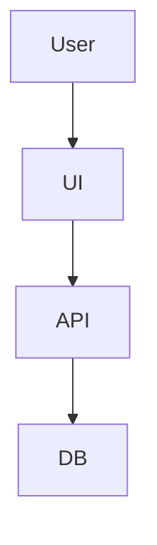

# Brainstorm Template

## Product Goal
- ...

## Agent Roundtable
- Main agent summary
- Key questions
- Final decisions

## Frontend Direction
- Theme:
- Layout:
- Screens:

## Backend/API Direction
- Services:
- Endpoints:
- Auth:

## Data and Infra
- Database:
- Environments:
- Deployment:

## Visuals
### Mermaid Workflow


### ASCII Wireframe
```text
+--------------------------------+
| Header                         |
+--------------------------------+
| Main content                   |
| Sidebar / actions              |
+--------------------------------+
```
