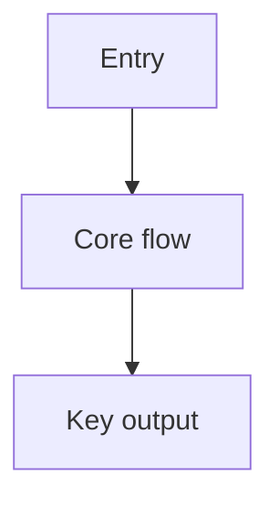

# Discovery Template

## Project Reality Scan
- Repo type:
- Main runtime(s):
- Entry points:
- Primary modules:

## Frontend Understanding
- Screens:
- Theme/design clues:
- Component structure:

## Backend Understanding
- Routes/services:
- Data/auth/integrations:
- Infra assumptions:

## Tests and Quality
- Existing tests:
- Missing coverage:
- Known risks:

## Visuals
### Mermaid Flow


### ASCII Wireframe
```text
+----------------------+
| Screen / module view |
+----------------------+
| details              |
+----------------------+
```
